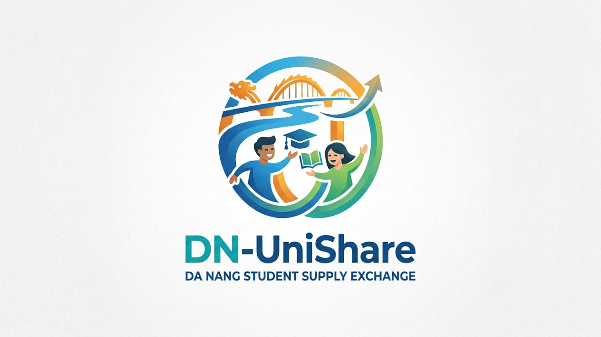

# ĐN-UniShare — Nền tảng Kết nối Sẻ chia Sinh viên Đà Nẵng

<div align="center">



**Chia sẻ hôm nay, giúp đỡ ngày mai.**

Nền tảng kết nối chia sẻ đồ dùng, sách vở, tài liệu và suất ăn cho sinh viên các trường Đại học tại Làng Đại học Đà Nẵng.

[](https://nextjs.org/)
[](https://www.typescriptlang.org/)
[](https://tailwindcss.com/)
[](https://www.framer.com/motion/)

</div>

---

## 📸 Giao diện

### Trang chủ


### Khám phá món đồ


### Đăng món đồ


### Thống kê tác động


---

## 🎯 Giới thiệu

**ĐN-UniShare** giải quyết một vấn đề thực tế tại Làng Đại học Đà Nẵng: mỗi năm hàng tấn sách vở, đồ dùng ký túc xá và vật dụng học tập bị bỏ lại khi sinh viên tốt nghiệp hoặc chuyển trọ, trong khi hàng ngàn tân sinh viên phải chi trả cho những vật dụng tương tự.

Nền tảng kết nối **người có đồ không dùng nữa** với **người đang cần**, giúp:
- 🌱 **Giảm rác thải** — Kéo dài vòng đời vật dụng sinh viên
- 💰 **Tiết kiệm chi phí** — Giúp sinh viên giảm gánh nặng tài chính
- 🤝 **Xây dựng cộng đồng** — Lan tỏa tinh thần sẻ chia trong Làng Đại học

---

## ✨ 5 Chức năng Cốt lõi

| # | Chức năng | Mô tả |
|---|-----------|-------|
| 1 | **Đăng món đồ** | Form đăng tin tối ưu, hỗ trợ chọn danh mục, tình trạng, và điểm hẹn tại Làng Đại học |
| 2 | **Khám phá & Tìm kiếm** | Bộ lọc đa chiều (danh mục, tình trạng), tìm kiếm realtime |
| 3 | **Chi tiết & Tương tác** | Trang chi tiết với hình ảnh lớn, thông tin người đăng, điểm hẹn an toàn |
| 4 | **Gửi yêu cầu nhận** | Quy trình "Gửi yêu cầu → Chờ duyệt → Nhận đồ" trực quan |
| 5 | **Thống kê tác động** | Dashboard thống kê số lượng đồ trao đổi, rác thải giảm, chi phí tiết kiệm |

---

## 🛠 Công nghệ sử dụng

| Công nghệ | Phiên bản | Vai trò |
|-----------|-----------|---------|
| **Next.js** | 16 (App Router) | Framework React, SSR/SSG, Routing |
| **TypeScript** | 5 | Type safety, code quality |
| **Tailwind CSS** | 4 | Styling utility-first |
| **Framer Motion** | 12 | Animations & micro-interactions |
| **Zustand** | 5 | State management (persist to localStorage) |
| **Lucide React** | — | Icon library |

---

## 📁 Cấu trúc dự án

```
src/
├── app/                          # Next.js App Router
│   ├── layout.tsx                # Root layout (font Outfit, metadata)
│   ├── page.tsx                  # Trang chủ (Hero + Featured Items + CTA)
│   ├── globals.css               # Design System (colors, cards, badges, buttons)
│   ├── items/page.tsx            # Trang khám phá & tìm kiếm
│   ├── post/page.tsx             # Trang đăng món đồ
│   ├── detail/[id]/page.tsx      # Trang chi tiết vật phẩm (dynamic route)
│   ├── impact/page.tsx           # Trang thống kê tác động cộng đồng
│   └── about/page.tsx            # Trang giới thiệu
├── components/
│   ├── layout/
│   │   ├── header.tsx            # Navigation header (responsive, sticky)
│   │   └── footer.tsx            # Footer 4 cột
│   └── home/
│       └── hero-section.tsx      # Hero section (category cards, floating icons)
├── lib/
│   ├── data.ts                   # Mock data, interfaces, constants (12 items)
│   └── store.ts                  # Zustand store (persist localStorage)
└── styles/                       # (Reserved for future CSS modules)

public/
└── logo.png                      # Logo ĐN-UniShare

docs/
└── screenshots/                  # Screenshots giao diện
```

---

## 🚀 Hướng dẫn Cài đặt & Chạy

### Yêu cầu hệ thống
- **Node.js** >= 18
- **npm** hoặc **bun**

### Cài đặt

```bash
# Clone dự án
git clone <repository-url>
cd my-project

# Cài đặt dependencies
npm install
```

### Chạy Development Server

```bash
npm run dev
```

Mở trình duyệt tại **http://localhost:3000**

### Build Production

```bash
npm run build
npm start
```

---

## 🗺 Điểm hẹn trao đổi

Tất cả các điểm hẹn đều nằm trong khu vực **Làng Đại học Đà Nẵng** để đảm bảo an toàn:

| Điểm hẹn | Khu vực |
|-----------|---------|
| KTX Làng Đại học | Khu ký túc xá chung |
| Thư viện ĐH Bách Khoa | ĐH Bách Khoa Đà Nẵng |
| Cổng chính Làng Đại học | Cổng chính khu đô thị |
| Căn-tin ĐH Sư phạm | ĐH Sư phạm Đà Nẵng |
| Sảnh ĐH Kinh tế | ĐH Kinh tế Đà Nẵng |
| Thư viện ĐH Ngoại ngữ | ĐH Ngoại ngữ Đà Nẵng |
| Khu tự học Làng Đại học | Khu học tập chung |
| Nhà ăn ĐH Bách Khoa | ĐH Bách Khoa Đà Nẵng |

---

## 📊 Danh mục vật phẩm

| Danh mục | Emoji | Ví dụ |
|----------|-------|-------|
| Sách giáo trình | 📚 | Giải tích, Lập trình C++, TOEIC |
| Đồ học tập | 🎓 | Balo, chuột, bàn phím cơ |
| Đồ ký túc xá | 🏠 | Nồi cơm, quạt, đèn bàn, ổ cắm |
| Suất ăn & Voucher | 🍜 | Suất cơm, voucher Highland, giảm giá |
| Tài liệu | 📄 | Slide bài giảng, đề thi, tài liệu ôn |

---

## 🔮 Phát triển trong tương lai

- [ ] **Backend API** — Thay thế Zustand store bằng REST API (Prisma + PostgreSQL)
- [ ] **Xác thực người dùng** — Đăng nhập bằng email trường (`.edu.vn`)
- [ ] **Upload ảnh thực** — Tích hợp Cloudinary hoặc S3
- [ ] **Chat realtime** — Nhắn tin giữa người tặng và người nhận
- [ ] **Thông báo push** — Khi có yêu cầu mới hoặc được duyệt
- [ ] **Bộ lọc theo trường** — Lọc vật phẩm theo ĐH Bách Khoa, Sư phạm, Kinh tế...
- [ ] **PWA** — Hỗ trợ cài đặt ứng dụng trên điện thoại

---

## 👥 Đóng góp

Mọi đóng góp đều được chào đón! Vui lòng:

1. Fork dự án
2. Tạo branch mới (`git checkout -b feature/ten-tinh-nang`)
3. Commit thay đổi (`git commit -m "Thêm tính năng XYZ"`)
4. Push lên branch (`git push origin feature/ten-tinh-nang`)
5. Tạo Pull Request

---

## 📝 Giấy phép

Dự án này được phát triển cho mục đích giáo dục và cộng đồng sinh viên Đà Nẵng.

---

<div align="center">

**Made with 💚 for Da Nang Students**

© 2025 ĐN-UniShare

</div>
